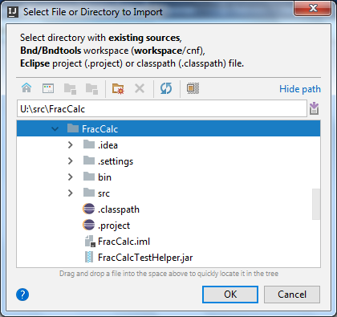
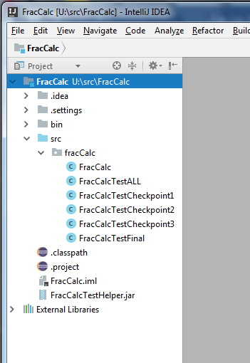

Introduction
============

> The objective of this assignment is to create a calculator to compute
> arithmetic operations between integers and/or fractions and output the
> result as a reduced mixed fraction.

Specifications
==============

Input
-----

> Input will be in the form of a value, followed by an arithmetic
> operator, and then another value. Values and operators will be
> separated by a single space. Values will contain no spaces.
>
> Input values may be in the form of mixed fractions, proper fractions,
> improper fractions or integers. The integer and fraction parts of a
> mixed fraction will be separated by an underscore (\_) (e.g., "1\_3/4"
> is one and three fourths to distinguish it from "13/4" which is
> thirteen fourths).
>
> The calculator will support the 4 basic arithmetic operations: add
> (+), subtract (-), multiply (\*), and divide (/).
>
> The program should accept an equation, calculate the result in the
> proper form, print it to screen, and then be ready to accept another
> equation. The user should be able to exit the program by entering the
> command "quit\" instead of an equation.
>
> *See the examples section below for clarification.*

Output
------

> The output value must always be reduced and never improper (it may be
> an integer, fraction, or mixed fraction, as appropriate). Example: a
> result of 10/4 should be printed to the screen as 2\_1/2).

  Input              Output   Notes
  ------------------ -------- ---------------------------------------------
  1/4 + 1\_1/2       1\_3/4   
  8/4 + 2            4        Input may be an improper fraction.
  -1 \* -1/2         1/2      
  -11/17 + -1/17     -12/17   
  0 \* 25\_462/543   0        Remember to check for border/special cases.

> *See the examples section below for clarification.*

Examples
========

> Use the included unit tests (described below) to thoroughly check your
> program, well beyond the above examples. We use these same tests to
> grade your project.

Code Organization
=================

> You must organize your code in the following way to receive credit for
> your project. If you deviate from this, your unit tests will fail, and
> significant points will be deducted from your grade.

1.  You must complete the implementation for the following method,
    inside your FracCalc.java file:

> public static String produceAnswer(String input)
>
> This method receives a single line of user input as its parameter (for
> example, "3\_1/2 + 1/4\"), and returns the answer (for example,
> "3\_3/4"). *This method does not print anything*!

2.  Your main() method must use a Scanner to receive input from the
    user, call *produceAnswer* with that input, and then print the
    answer that was returned by *produceAnswer*. Your main method
    eventually is responsible for *repeatedly* reading input from the
    user, calling produceAnswer(), printing the result, and ending once
    the user types "quit", although in the first checkpoint only one
    line of input needs to be read, with a single response printed to
    the console.

3.  **Your code must pass the unit tests** for the checkpoint you're
    submitting. If all the tests fail, that is a sign your code is
    organized incorrectly. Fix before submitting to us.

Comments
========

Getting Started
===============

> These instructions will result in a brand new project, which includes
> the Unit Testing infrastructure that will make it easy for you verify
> your fractional calculator.

1.  Copy the folder of FracCalc starter files:\
    \
    P:\\Instruction\\Urner\_Douglas\\Urner\_Douglas-1\\Collaboration\\FracCalc\
    \
    into your source folder.

2.  Launch IntelliJ

3.  If you already have a project named "FracCalc", you will need to
    rename it so that it does not collide with the project you are now
    importing. You can rename a project by right-clicking the project in
    the Package Explorer window, choosing Refactor, Rename, and then
    typing in the new name.

4.  From the Welcome dialog, choose Import Project.

    

5.  In the Select File or Directory to Import dialog chose your FracCalc
    folder. Then click OK.\
    \
    

6.  Choose Next to accept the defaults in the resulting dialogs

7.  Click Finish

8.  You should have the project imported in the project pane on the left
    hand side. You will do your work in **FracCalc.java**.

10. Right-click on the FracCalcTestHelper.java file and select Add
    Library.

11. To run all tests, **open FracCalcTestALL.java**, and run. If the
    test methods are not recognized select one and type Alt-Enter and
    select add Junit4.

Checkpoints
===========

> There will be 3 checkpoints to ensure that the calculator is on track
> for completion. They are required, and are worth a substantial part of
> your grade (see breakdown below). You must submit them on time to
> receive full credit.

Checkpoint 1: Parsing one line of input
---------------------------------------

-   The *main*() method creates a Scanner, uses it to read one line of input, and
    passes that input to *produceAnswer*().

-   *produceAnswer*() breaks the line of input into three Strings:
    - the first operand (fraction),
    - the operator (+ - \* /),
    - and the second operand (fraction).
    
    Each of these Strings should be stored in
    variables inside *produceAnswer*().

-   *produceAnswer*() returns the second operand. For example,
    *produceAnswer*("1\_2/3 + 4\_5/6") should return "4\_5/6".

-   Finally, *main*() prints the result returned by *produceAnswer*()

Checkpoint 2: Multiple lines of input, parsing fractions
--------------------------------------------------------

-   Your *main*() method now accepts input from the user multiple times
    (until the user types "quit")

-   For each line of input, *main*() calls *produceAnswer*() and prints the
    returned result

-   This time, *produceAnswer*() must further parse each operand into 3
    integer variables, one each for the numerator, denominator, and
    whole portion (for mixed fractions or integers). Note that there are
    cases where not all 3 of these components are present (see below).

-   *produceAnswer*() now must demonstrate you have parsed fractions
    properly by returning a string that describes each component of the
    second operand: the whole number portion (or 0 if not specified),
    the numerator (or 0 if not specified), and the denominator (or 1 if
    not specified). Examples:

    -   *produceAnswer*(\"5\_3/4 - 6\_5/8\") returns \"whole:6 numerator:5
        denominator:8\"

    -   *produceAnswer*(\"-3/7 - 20\") returns \"whole:20 numerator:0
        denominator:1\"

    -   *produceAnswer*("-32 - 27/21") returns \"whole:0 numerator:27
        denominator:21\"

> **Checkpoint 3: Evaluation**

-   *produceAnswer*() must now evaluate the formula it is given
    (performing addition, subtraction, multiplication, and division,
    based on the operator specified), and return the actual answer of
    that calculation (instead of just returning the second operand).

-   The *answer* need not be reduced, and need not be a mixed fraction.
    But it must be correct.

-   All kinds of *input values* the user might enter must be accepted,
    including simple fractions, improper fractions, mixed fractions, and
    integers.

Final Project: All requirements complete
========================================

-   All answers must be reduced

-   All tests should pass

Extra Credit
============

> *Do not spend time on extra credit until you have everything else
> working properly.*

Multiple Operations
-------------------

-   This extra credit will be awarded for calculators that can take in
    arbitrarily many values and operators. This will only be tested with
    compatible operations such that all equations are evaluated from
    left to right, in the order they appear (i.e. you will not need to
    worry about order of operations).

  Input                       Output
  --------------------------- ---------
  1 + 2 + 3                   6
  3/4 \* 4                    3
  -1/2 \* 4 + 3/4             -1\_1/4
  5\_3/4 - -6\_8/8 - 5\_3/4   7

  Input     Output
  --------- ---------------------------------------
  1/0 + 1   ERROR: Cannot divide by zero.
  1 ++ 2    ERROR: Input is in an invalid format.

Error Handling
--------------

-   This extra credit will be awarded for calculators that do not crash
    when erroneous input is provided, but instead print useful error
    messages. Any error encountered based on user input should print
    "ERROR: " to the screen followed by an informative error message.

Grading Breakdown
=================

  REQUIREMENT                    POINTS
  ------------------------------ ----------------
  Input Parsing                  15
  Addition & Subtraction         20
  Multiplication & Division      20
  Fraction Reduction             15
  Output is a Mixed Fraction     15
  Handles Mixed Fractions        10
  Handles Negatives              15
  Checkpoints                    35
  Code Comments                  5
  TOTAL                          **150 points**
                                 
  *Extra: Multiple Operations*   4
  *Extra: Error Handling*        4
